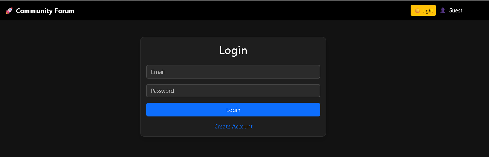
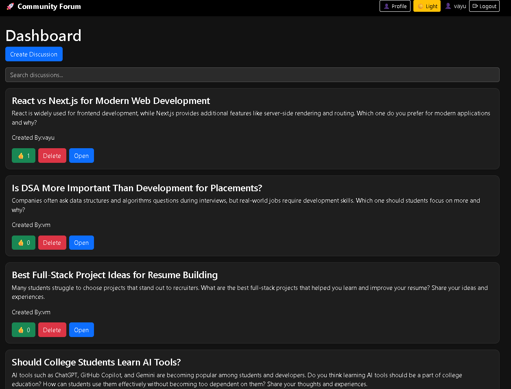
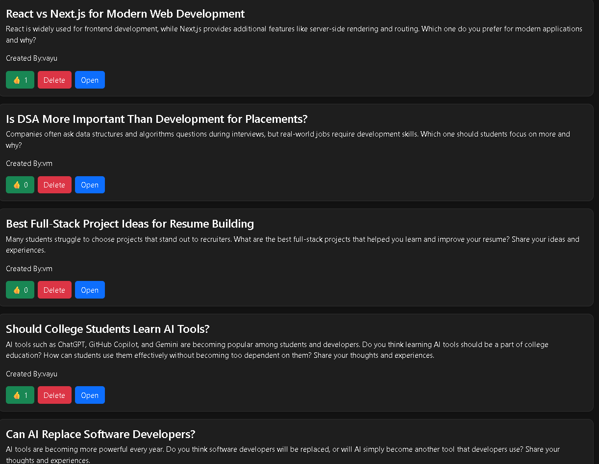
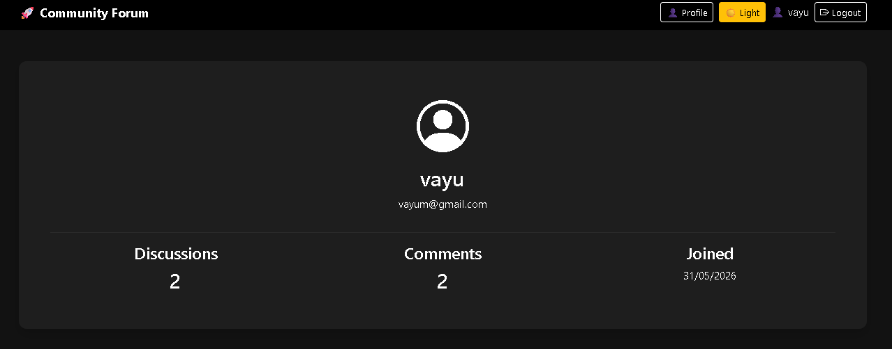
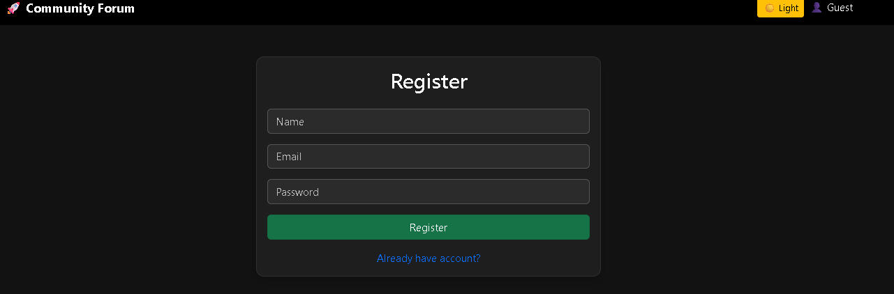
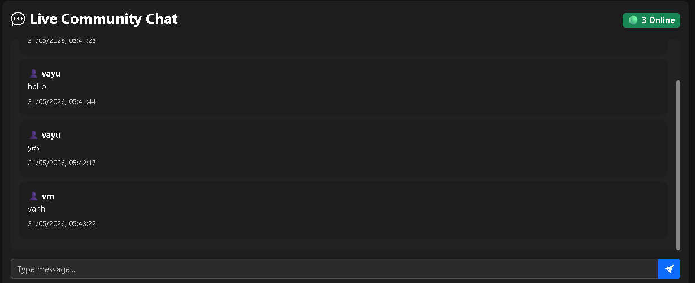

# 🚀 Community Forum MERN

A full-stack Community Discussion Forum built using the MERN Stack (MongoDB, Express.js, React.js, Node.js) with Socket.IO for real-time communication. Users can create discussions, comment, like posts, manage profiles, and interact in real time through a modern responsive interface.

## 🌐 Live Demo

**Frontend:** https://community-forum-mern.vercel.app

**Backend API:** https://community-forum-api.onrender.com

**GitHub Repository:** https://github.com/Vayu-143/community-forum-mern

---

# 👨‍💻 Developer

**Vayunandan Mishra**

---

# 📖 Overview

Community Forum MERN is a full-stack discussion platform where users can:

- Register and Login securely
- Create and manage discussions
- Like discussions (One Like Per User)
- Add comments to discussions
- Delete their own discussions
- View profile statistics
- Participate in real-time chat
- Switch between Dark and Light themes
- Use the platform on desktop and mobile devices

---

# ✨ Features

## 🔐 Authentication

- User Registration
- User Login
- JWT Authentication
- Protected Routes

## 💬 Discussions

- Create Discussion
- View All Discussions
- View Discussion Details
- Delete Discussion
- Discussion Author Tracking

## ❤️ Likes System

- One Like Per User
- Prevent Duplicate Likes
- Real-Time Updates

## 📝 Comments

- Add Comments
- View Comments
- Auto Cleanup When Discussion Is Deleted

## 👤 User Profile

- Profile Information
- Total Discussions Count
- Total Comments Count
- Joined Date

## ⚡ Real-Time Features

- Socket.IO Integration
- Live Chat Support
- Instant Communication

## 🎨 UI Features

- Dark Mode
- Light Mode
- Responsive Design
- Bootstrap Styling

---

# 🛠️ Tech Stack

## Frontend

- React.js
- React Router DOM
- Axios
- Bootstrap
- Socket.IO Client
- Context API

## Backend

- Node.js
- Express.js
- MongoDB
- Mongoose
- JWT Authentication
- bcryptjs
- Socket.IO

## Deployment

- Vercel (Frontend)
- Render (Backend)
- MongoDB Atlas (Database)

---

# 📂 Project Structure

```bash
community-forum-mern/
│
├── client/
│   ├── src/
│   │   ├── components/
│   │   ├── context/
│   │   ├── pages/
│   │   ├── services/
│   │   ├── sockets/
│   │   └── main.jsx
│   │
│   ├── public/
│   ├── .env
│   └── package.json
│
├── server/
│   ├── controllers/
│   ├── middleware/
│   ├── models/
│   ├── routes/
│   ├── sockets/
│   ├── config/
│   ├── server.js
│   └── package.json
│
├── docs/
│   ├── api-docs/
│   ├── architecture/
│   └── screenshots/
│
├── README.md
└── .gitignore
```

---

# 🔑 Environment Variables

## Client (.env)

```env
VITE_API_URL=https://community-forum-api.onrender.com/api

VITE_SOCKET_URL=https://community-forum-api.onrender.com
```

## Server (.env)

```env
PORT=5000

MONGO_URI=YOUR_MONGODB_ATLAS_URI

JWT_SECRET=YOUR_SECRET_KEY

CLIENT_URL=https://community-forum-mern.vercel.app
```

---

# ⚙️ Installation

## Clone Repository

```bash
git clone https://github.com/Vayu-143/community-forum-mern.git

cd community-forum-mern
```

## Install Backend Dependencies

```bash
cd server

npm install
```

## Install Frontend Dependencies

```bash
cd client

npm install
```

---

# ▶️ Run Locally

## Start Backend

```bash
cd server

npm run dev
```

## Start Frontend

```bash
cd client

npm run dev
```

---

# 🌍 API Routes

## Authentication

```http
POST /api/auth/register

POST /api/auth/login
```

## Discussions

```http
GET /api/discussions

POST /api/discussions

GET /api/discussions/:id

PUT /api/discussions/like/:id

DELETE /api/discussions/:id
```

## Comments

```http
GET /api/comments/:discussionId

POST /api/comments
```

## User

```http
GET /api/users/profile
```

---

# 🔒 Security Features

- Password Hashing using bcryptjs
- JWT Authentication
- Protected API Routes
- Authorization Middleware
- User Ownership Validation
- Duplicate Like Prevention

---

# 📸 Screenshots

Add project screenshots inside:

```bash
docs/screenshots/
```

Example:

```bash
docs/screenshots/login.png

docs/screenshots/dashboard.png

docs/screenshots/discussion-details.png

docs/screenshots/profile.png

docs/screenshots/register.png

docs/screenshots/chat.png
```

Then display them:

```md
## Login Page



## Dashboard



## Discussion



## Profile



## Register



## Chat


```

---

# 🚀 Deployment

## Frontend

- Vercel

## Backend

- Render

## Database

- MongoDB Atlas

---

# 🎯 Future Improvements

- Edit Discussions
- Edit Comments
- User Profile Pictures
- Discussion Search & Filters
- Discussion Categories
- Notifications
- Friend System
- Admin Dashboard
- Pagination
- Forgot Password
- Email Verification
- Real-Time Notifications

---

# 📈 Resume Project Description

**Community Forum MERN Application**

Developed a full-stack discussion platform using React.js, Node.js, Express.js, MongoDB, and Socket.IO. Implemented JWT-based authentication, discussion management, comment system, profile analytics, real-time chat, dark/light theme support, and responsive UI. Deployed the frontend on Vercel, backend on Render, and database on MongoDB Atlas.

---

# 🤝 Contributing

Contributions are welcome.

1. Fork the repository
2. Create a feature branch
3. Commit your changes
4. Push to your branch
5. Open a Pull Request

---

⭐ If you found this project useful, please give it a Star on GitHub!